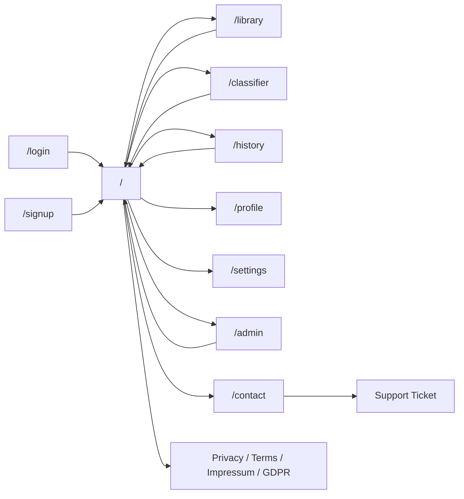
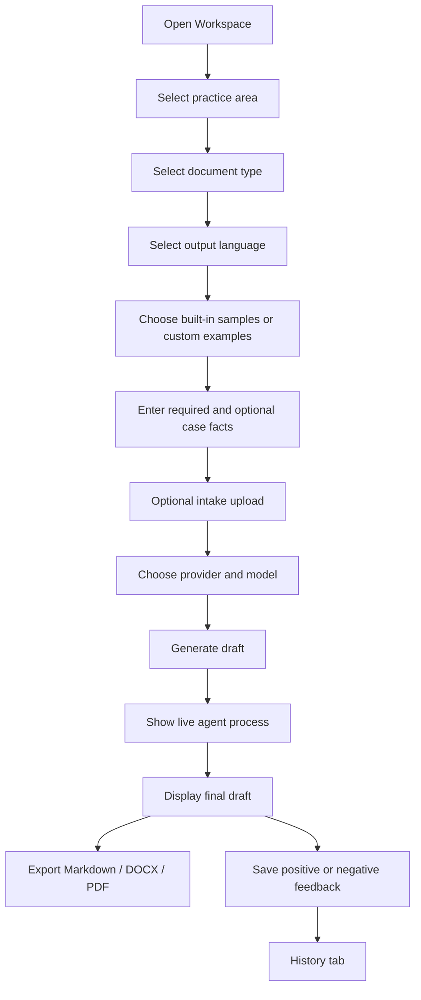
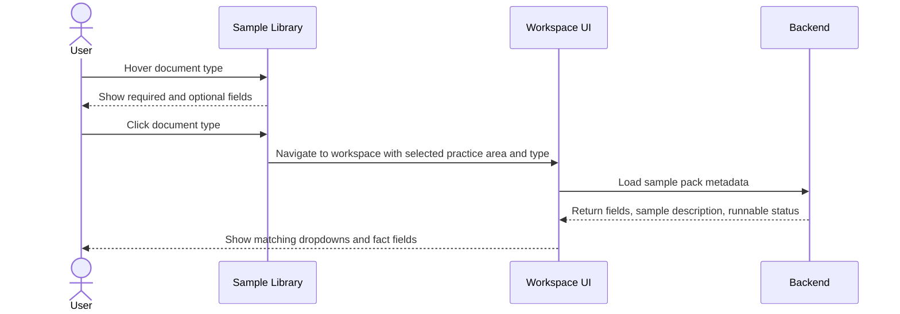
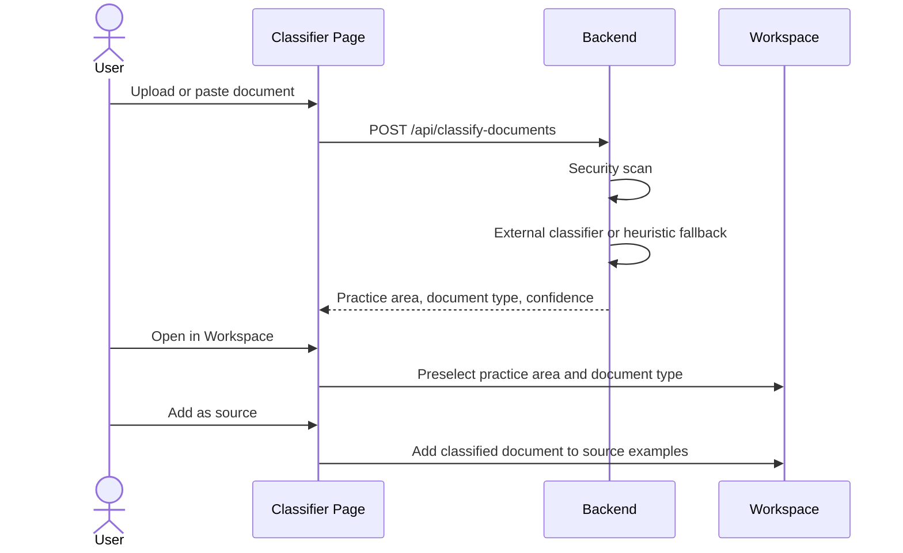
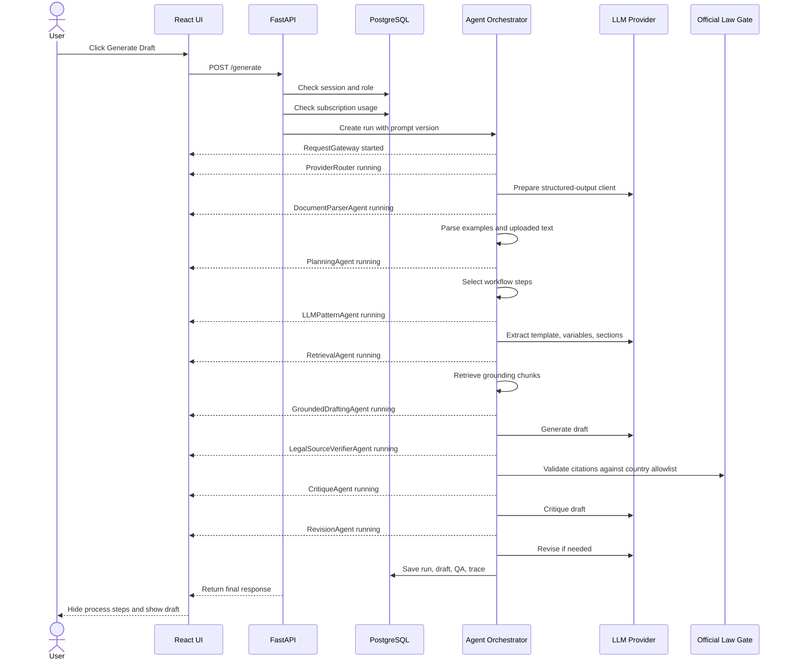
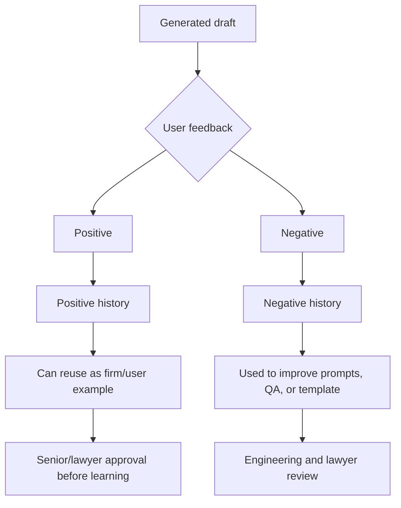
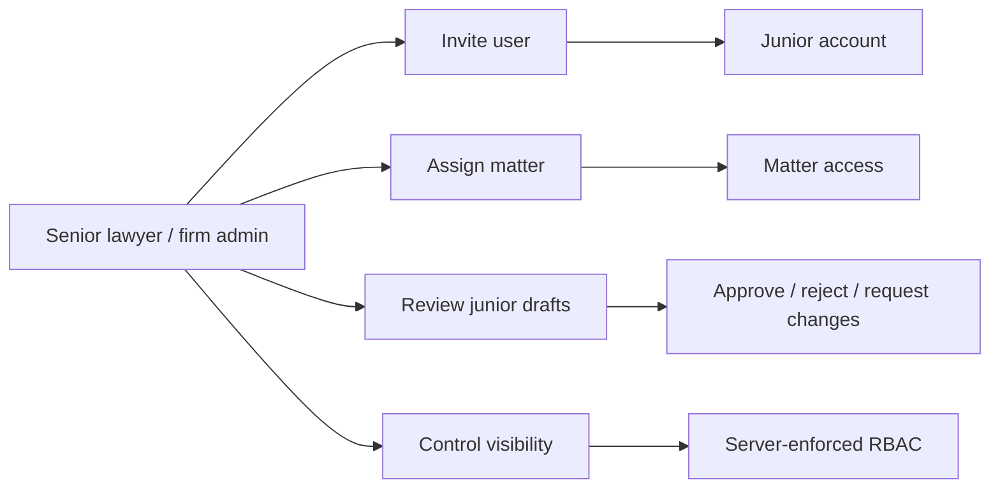
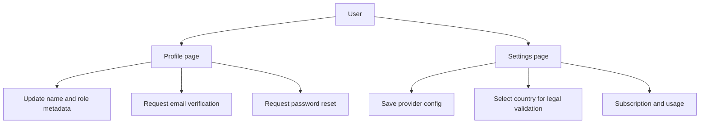
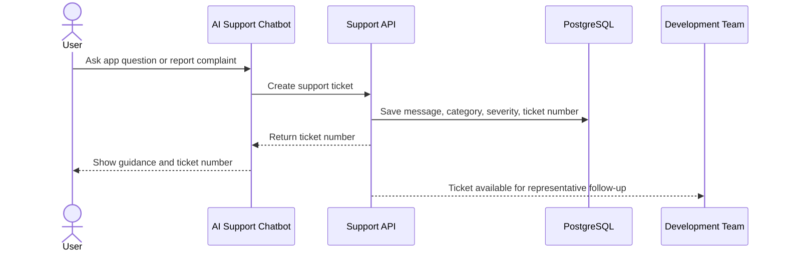
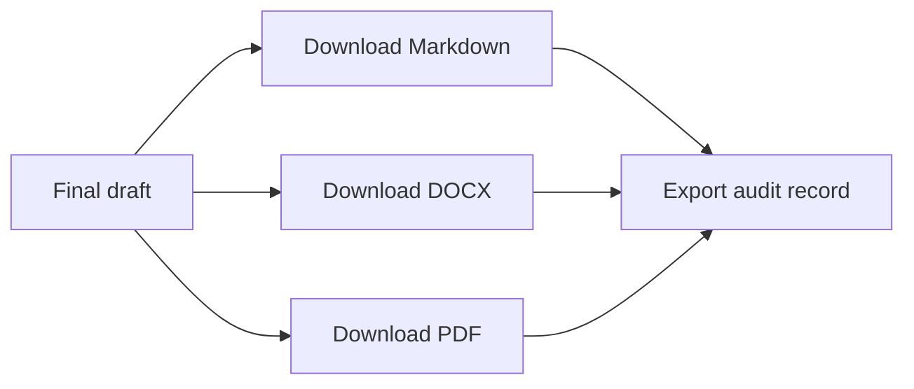

# Application Flow

This document describes how the application behaves from login to generated
draft, review, feedback, and future learning.

## Page-Level Flow



## Workspace Flow



## Library To Workspace Flow



## Classifier To Workspace Flow



## Draft Generation Flow



## User Feedback Flow



## Firm Admin Flow



## Profile And Settings Flow



## Contact And AI Support Flow



## Export Flow



Production exports should store a file hash, export timestamp, user ID, matter
ID, and draft version. The lawyer should be able to prove which text was
generated, reviewed, exported, and approved.

## Backend Status Messages

The frontend should show the process as short live steps, then fade them out
when complete:

```text
ProviderRouter
DocumentParserAgent
PlanningAgent
LLMPatternAgent
RetrievalAgent
GroundedDraftingAgent
LegalSourceVerifierAgent
CritiqueAgent
RevisionAgent
HumanReviewAgent
```

The full detailed run log remains available in the trace/debug panel for
developers and reviewers.
