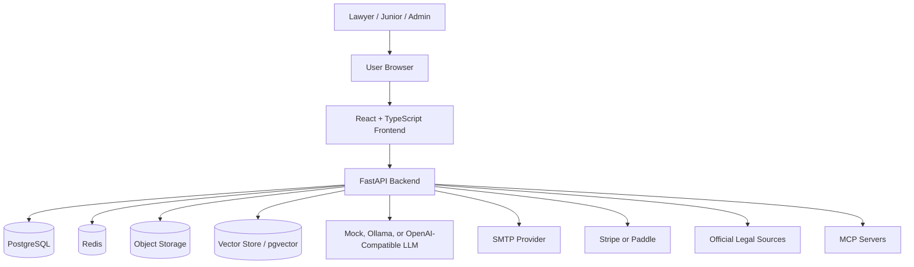
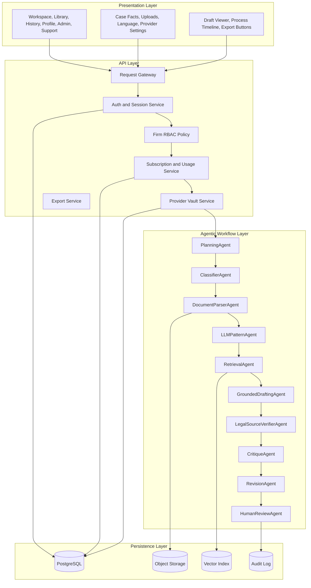
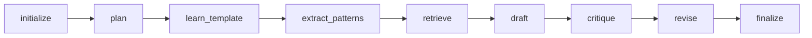
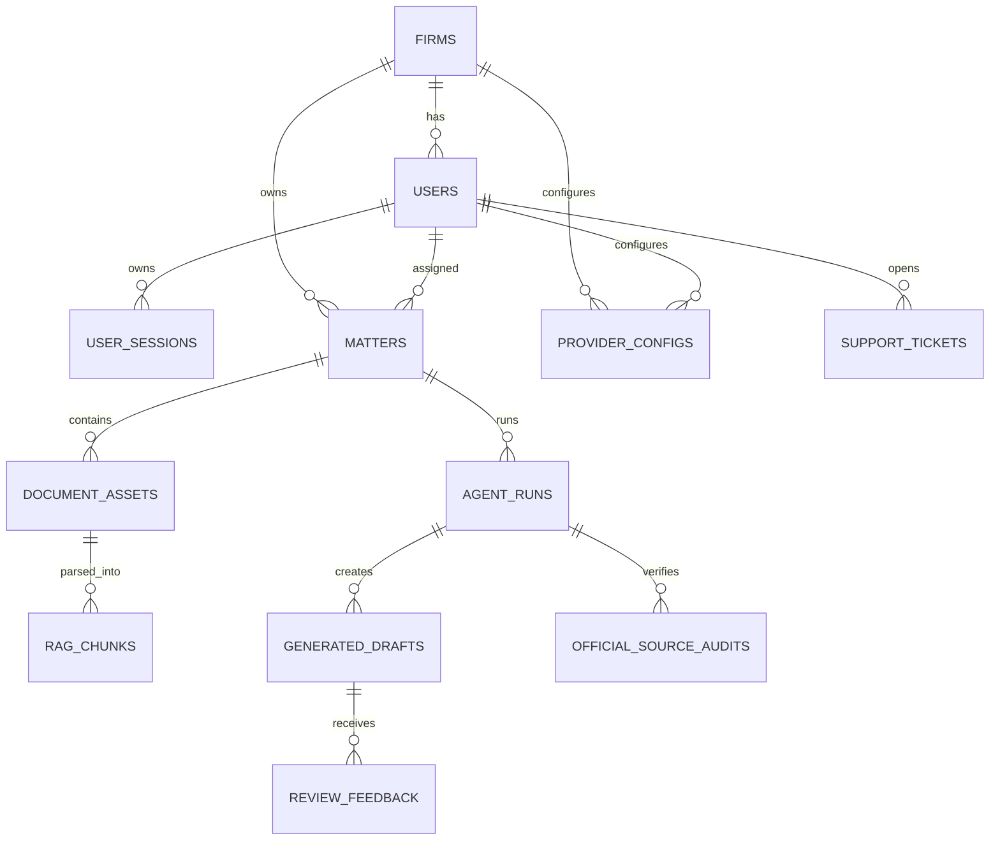
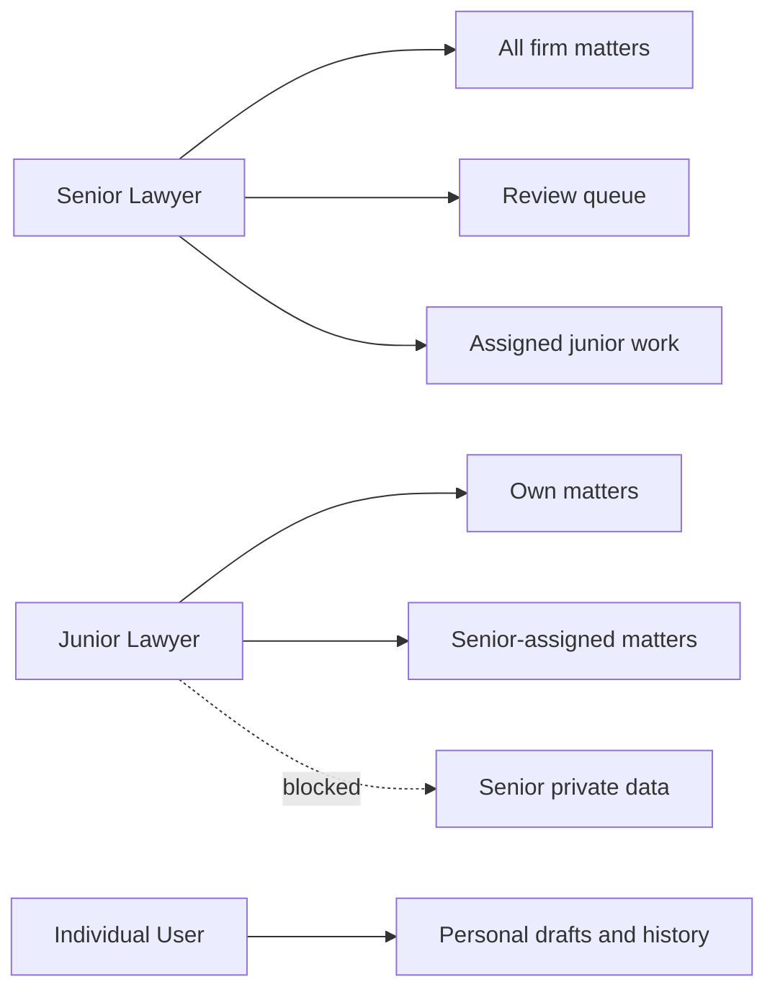
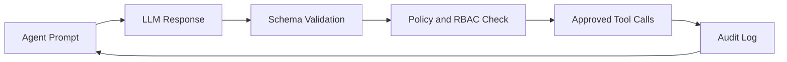
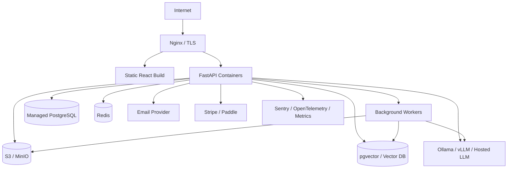

# Architecture

This document explains the technical architecture of Legal AI Pattern Drafting
Studio from prototype to production. The design keeps the assessment pipeline
easy to run while showing how the same responsibilities scale into a real
multi-tenant legal drafting product.

## Architecture Goals

- Learn drafting patterns from approved prior documents.
- Separate fixed firm language from matter-specific variables.
- Retrieve grounding material from firm examples and official law sources.
- Generate drafts in the requested output language.
- Validate citations, completeness, consistency, and missing facts.
- Keep lawyers in control through review, feedback, and approval flows.
- Preserve traceability for every agent decision, prompt, source, and output.
- Support individual users and firms with senior/junior access controls.

## System Context



## Layered Architecture



## Agent Responsibilities

| Agent | Responsibility | Current State | Production Upgrade |
|---|---|---|---|
| `RequestGateway` | Normalize request metadata and create run ID | Implemented in backend flow | Add idempotency keys and async jobs |
| `ProviderRouter` | Select mock, Ollama, or API provider | Implemented | Add cost policy, fallback, health checks |
| `PlanningAgent` | Decide workflow steps and prompt versions | Implemented | Add dynamic tool planning and retries |
| `ClassifierAgent` | Classify uploaded document type | Heuristic and command hook | Connect pretrained classifier |
| `DocumentParserAgent` | Parse Markdown/source examples | Implemented | Add PDF, DOCX, OCR, layout parsing |
| `LLMPatternAgent` | Learn sections, variables, fixed language | Implemented with structured output | Add lawyer approval and template versions |
| `RetrievalAgent` | Retrieve grounding source chunks | Lexical prototype | Add embeddings, reranker, tenant filters |
| `GroundedDraftingAgent` | Generate draft from facts, template, chunks | Implemented | Add stronger model and clause locking |
| `LegalSourceVerifierAgent` | Validate country-specific official law sources | Allowlist gate scaffold | Add live official search and citation matching |
| `CritiqueAgent` | Review quality, missing facts, risk | Implemented | Add rubric and lawyer-scored eval set |
| `RevisionAgent` | Revise based on critique | Implemented | Add redline diff and version comparison |
| `HumanReviewAgent` | Persist review packet and feedback | Implemented as review workflow scaffold | Add senior approval queue and redlines |

## Orchestration Options

The project has two orchestration paths:

| Workflow | File | Purpose |
|---|---|---|
| Custom orchestrator | `src/legal_pattern_system/agentic_orchestrator.py` | Default assessment/MVP path with no extra dependencies |
| LangGraph orchestrator | `src/legal_pattern_system/langgraph_orchestrator.py` | Optional production-style state-machine workflow |

The LangGraph path keeps each major agent step as an explicit graph node:



Run it with:

```bash
pip install ".[langgraph]"
python scripts\run_agentic_pipeline.py --doc-type dismissal_protection_suits --workflow langgraph
```

Future LangGraph upgrades should add conditional edges for blocked security
checks, weak retrieval, missing facts, failed citation verification, and human
review interrupts.

## Data Architecture



PostgreSQL stores structured data and references. Large files and exports should
move to object storage in production. Embeddings should move to `pgvector` or a
dedicated vector database when retrieval grows.

## Multi-Tenant Access Model



Rules:

- Senior lawyers can review firm-level work and assigned junior work.
- Juniors cannot see senior private drafts unless explicitly assigned.
- Individual users remain isolated from firm tenants.
- Retrieval must always filter by tenant, matter, user role, and data policy.

## LLM And Tool Boundary

The LLM should propose structured outputs. The backend remains responsible for
validation, policy, storage, and audit.



Important production rule: do not let the model directly execute MCP, web
search, payment, email, or storage actions. The orchestrator must approve,
execute, sanitize, and audit every tool call.

For the detailed security model, see
`docs/agent_security_sandboxing.md`.

## Prompt-Injection And Jailbreak Defense

Uploaded documents, pasted facts, retrieved source chunks, legal web pages, and
MCP tool outputs are untrusted data. They must not be treated as instructions.

Production defenses:

- label source text as untrusted evidence in prompts,
- never place provider keys or secrets in prompts,
- validate every LLM response against a schema,
- block tool calls that do not pass backend policy,
- filter retrieval by tenant, matter, role, country, and approved source,
- audit allowed and denied tool calls,
- quarantine suspicious outputs that attempt to bypass jurisdiction, RBAC, or
  lawyer-review rules.

## Failure Handling

| Failure | Expected Handling |
|---|---|
| Missing required facts | Block generation or return required-fields response |
| Unsupported document type | Classify as custom and ask for sample examples |
| LLM malformed JSON | Retry, normalize conservative shapes, or fail safely |
| Legal source from wrong country | Reject source and log audit event |
| Junior requests unassigned matter | Return forbidden and audit |
| Usage limit reached | Return upgrade/payment response |
| Long OCR or drafting job | Queue background job and stream status |
| Low QA or citation confidence | Route to lawyer review with warning |

## Observability

Every run should have:

- run ID,
- user ID and firm ID,
- document type and jurisdiction,
- prompt versions,
- model/provider version,
- retrieved source IDs,
- legal source audit records,
- execution log events,
- QA score and findings,
- revision decision,
- export events,
- feedback outcome,
- latency, token use, and estimated cost.

## Production Deployment Shape



Start with this split:

- one CPU server/container group for frontend and API,
- managed PostgreSQL if possible,
- Redis for queues and rate limits,
- object storage for files and exports,
- separate GPU server for Ollama or vLLM when local model inference is needed.
