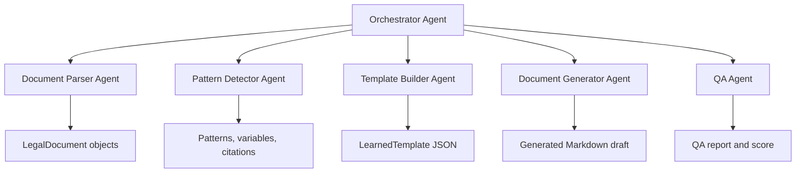

# Architecture

## Goal

Learn document patterns from multiple prior legal documents, turn those patterns
into reusable templates, generate new firm-specific drafts, and validate the
result before lawyer review.

## Prototype Boundary

The provided samples are Markdown, so the prototype uses a lightweight Markdown
parser. The system is intentionally designed around a parser adapter interface:

This keeps the current implementation simple while leaving a clean path to
production ingestion with layout-aware PDF parsing, DOCX parsing, OCR, or a
document-intelligence service.

## Agents

### Document Parser Agent

Input: file path.

Output: normalized `LegalDocument` with title, metadata, parties, headings,
sections, and raw text.

Current implementation: `MarkdownDocumentParser`.

Production extension: `PdfLayoutParser`, `DocxParser`, `OcrDocumentParser`.

### Pattern Detector Agent

Input: multiple `LegalDocument` objects of the same document family.

Output:

- stable vs variable metadata fields,
- stable vs variable party fields,
- required vs optional sections,
- repeated language variants,
- legal citations that require careful review.

The prototype uses deterministic rules so results are inspectable. In production,
this would be combined with embeddings, layout features, and LLM structured
outputs for semantic clause classification.

### Template Builder Agent

Input: detected field, section, and citation patterns.

Output: `LearnedTemplate`.

The template separates:

- fixed structure,
- variable placeholders,
- optional or low-confidence sections,
- legal citations for human validation.

### Document Generator Agent

Input: learned template plus new case data.

Output: generated Markdown draft.

The prototype renders from learned representative sections. In production, this
agent would use retrieval-grounded generation and constrained prompts that
preserve locked clauses.

### QA Agent

Input: learned template and generated draft.

Output: `QaReport` with score and findings.

Checks include:

- unresolved placeholders,
- missing required sections,
- missing expected legal citations,
- unusually short output.

Production checks would include citation validation, jurisdiction rules, clause
diffing against approved language, PII policy checks, and lawyer approval state.

### Orchestrator Agent

Coordinates the full workflow:

1. Parse all source documents.
2. Detect patterns.
3. Build template.
4. Generate draft.
5. Run QA.
6. Persist artifacts.

The orchestrator is also where production conflict handling belongs. For
example, if the pattern detector marks a clause as optional but QA treats it as
required, the orchestrator should escalate that template version to human review
instead of silently choosing one agent.

## Shared State

The prototype passes typed Python objects between agents. A production version
would persist agent outputs in a versioned template store:

- source document IDs,
- parser version,
- extracted sections,
- learned patterns,
- prompt versions,
- generated drafts,
- QA results,
- lawyer approvals and edits.

This makes the system auditable and debuggable.

## Conflict Handling

Agents should not resolve legal-risk conflicts by majority vote. The workflow
uses severity-aware rules:

- high legal or completeness risk: block generation and request lawyer review,
- medium risk: generate draft with warnings,
- low risk: log and continue.

Examples:

- Pattern detector sees a clause in only 60% of examples, but QA says it is
  legally required. Result: block or require lawyer approval.
- Generator changes a locked legal clause. Result: fail QA.
- Retrieved precedent conflicts with learned template language. Result: surface
  both sources and ask for lawyer decision.

## Failures and Resilience

Expected failure modes:

- unreadable files,
- OCR/layout extraction errors,
- documents from the wrong document family,
- inconsistent source documents,
- missing case data,
- low-confidence generation,
- LLM timeout or malformed structured output.

Recovery strategy:

- isolate failures per document,
- keep partial extraction artifacts,
- retry transient LLM/tool failures,
- fall back to deterministic checks,
- degrade to a review-only workflow when confidence is low.

## Observability

Production observability should include:

- trace ID per workflow run,
- per-agent input/output summaries,
- token cost and latency,
- parser confidence,
- template confidence,
- QA score,
- lawyer edit distance after review,
- approval/rejection outcomes,
- prompt and model versions.

The key evaluation loop is: generate, review, measure lawyer edits, update
patterns, and track whether QA catches the issues lawyers actually care about.
