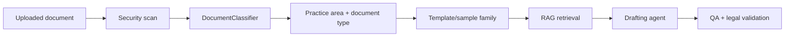

# Document Classifier And Open Legal Data

This document explains how to connect the separate `DocClassifier` project and
where to get open legal data for improving legal document classification.

## Current Local Classifier

Existing project:

```text
C:\Users\DELL\Documents\Tasks\JUPUS\DocClassifier
```

Observed dataset:

- 498 usable PDF samples.
- 17 labels.
- Selected model: `sgd_svm`.
- Holdout accuracy: `0.90`.
- Holdout macro F1: about `0.87`.

Useful labels for this legal drafting app:

| Classifier Label | Drafting App Mapping |
|---|---|
| `Kundigung` | Employment Law / Employer Notice of Termination |
| `Klageschrift` | Civil Law / Litigation Filing |
| `Schriftsatz` | Civil Law / Court Brief |
| `Vertrag&Vereinbarung` | Commercial / Contract or Agreement |
| `Mahnung` | Civil Law / Demand Letter |
| `Vergleich` | Employment or Civil / Settlement Agreement |
| `Berufung` | Civil Law / Appeal |
| `Lizenzierung` | IP / Licensing Agreement |
| `Steuererklärung` | Administrative or Tax / Tax Filing |

Some classes are still small or weak in the report. For example, `Berufung`,
`Klageschrift`, `Schreiben`, and `Schriftsatz` should receive more examples
before relying on them in production.

## How The App Calls Your Classifier

The backend now supports:

```text
DOCUMENT_CLASSIFIER_COMMAND
```

Recommended local command:

```text
python C:\Users\DELL\Documents\Tasks\JUPUS\ai-challenge\legal_pattern_system\scripts\classify_with_docclassifier.py --project-root C:\Users\DELL\Documents\Tasks\JUPUS\DocClassifier
```

PowerShell setup:

```powershell
$env:DOCUMENT_CLASSIFIER_COMMAND='python C:\Users\DELL\Documents\Tasks\JUPUS\ai-challenge\legal_pattern_system\scripts\classify_with_docclassifier.py --project-root C:\Users\DELL\Documents\Tasks\JUPUS\DocClassifier'
```

Safer production setup avoids shell parsing by using a JSON array:

```powershell
$env:DOCUMENT_CLASSIFIER_COMMAND='["python","C:\\Users\\DELL\\Documents\\Tasks\\JUPUS\\ai-challenge\\legal_pattern_system\\scripts\\classify_with_docclassifier.py","--project-root","C:\\Users\\DELL\\Documents\\Tasks\\JUPUS\\DocClassifier"]'
```

Backend flow:

1. User uploads or pastes document content.
2. Backend runs security scan first.
3. Backend sends JSON to the classifier command through stdin.
4. Adapter loads `best_document_classifier.joblib`.
5. Adapter returns JSON with practice area, document type, topic, confidence, and
   raw classifier label.
6. If the external classifier fails, backend falls back to heuristic routing.

## Adapter Contract

Input on stdin:

```json
{
  "filename": "uploaded.pdf",
  "content": "Extracted document text..."
}
```

Output on stdout:

```json
{
  "classifier": "docclassifier_external_adapter",
  "status": "classified",
  "filename": "uploaded.pdf",
  "raw_label": "Klageschrift",
  "practice_area": "Civil Law",
  "document_type": "civil_commercial_litigation",
  "topic": "Litigation Filing / Klageschrift",
  "confidence": 0.82,
  "signals": ["DocClassifier label: Klageschrift"]
}
```

## Free / Open Data Sources

Use these sources carefully and check the license before training or commercial
use.

### Open Legal Data Germany

Website:

```text
https://openlegaldata.io/
https://de.openlegaldata.io/
```

Good for:

- German court decisions,
- German laws,
- citations,
- metadata,
- legal NLP experiments.

Data access:

- REST API,
- data dumps,
- Hugging Face dataset references from OLDP documentation.

Important limitation:

- Court decisions help with legal-domain classification and citation/retrieval
  tasks, but they are not the same as law-firm draft documents. They can improve
  legal language understanding, but you still need firm-style documents for
  draft-type classification.

### Open Legal Data Platform Dumps

Documentation:

```text
https://openlegaldata.github.io/oldp/main/data-dumps.html
```

Good for:

- bulk German legal data,
- offline experiments,
- RAG corpus building,
- citation/link analysis.

### EUR-Lex

Website:

```text
https://eur-lex.europa.eu/
```

Good for:

- EU laws,
- regulations,
- directives,
- multilingual legal text.

Use for:

- official-law retrieval,
- multilingual legal classifier pretraining,
- citation validation.

### Harvard Caselaw Access Project

Website:

```text
https://case.law/
```

Good for:

- US case law,
- large-scale legal NLP,
- jurisdiction and court classification,
- retrieval evaluation.

Limitation:

- US law is not a substitute for German legal drafting examples.

### CUAD / LEDGAR / Contract Datasets

Good for:

- contract clause classification,
- contract/document type detection,
- clause extraction.

Limitation:

- Mostly contract-focused and usually not German litigation drafting.

## Best Training Strategy

For this project, train in layers:

1. **General legal-domain pretraining data**
   - Open Legal Data Germany,
   - EUR-Lex,
   - public laws and court decisions.

2. **Document-type classifier data**
   - your `DocClassifier/Datasets` PDFs,
   - firm-approved uploaded examples,
   - public sample forms where license allows,
   - manually labeled law-firm draft categories.

3. **Drafting-system labels**
   - practice area,
   - document type,
   - jurisdiction,
   - language,
   - required fields,
   - optional fields,
   - confidence and review-needed flag.

## Recommended Label Taxonomy

Use hierarchical labels:

```text
Employment Law
  Dismissal Protection Suit
  Employer Notice of Termination
  Settlement Agreement
  Salary Claim

Civil Law
  Claim for Damages
  Payment Claim
  Demand Letter
  Appeal

Commercial Law
  Contract
  Service Agreement
  Licensing Agreement

Administrative / Tax
  Tax Filing
  Visa Appeal
  Residence Permit Appeal
```

This lets the model be useful even when it is not confident about the exact
document type. It can still route to the correct practice area.

## What To Improve In The Existing Classifier

- Add more samples for weak classes.
- Normalize German umlauts consistently.
- Add a JSON prediction CLI, or use this project's adapter.
- Add `predict_proba` if you want calibrated confidence.
- Add confusion matrix to the report.
- Add class-level minimum sample thresholds.
- Add a legal taxonomy mapping file.
- Keep a separate test set that never enters training.
- Add OCR for scanned PDFs.

## How It Fits The Agentic Workflow


