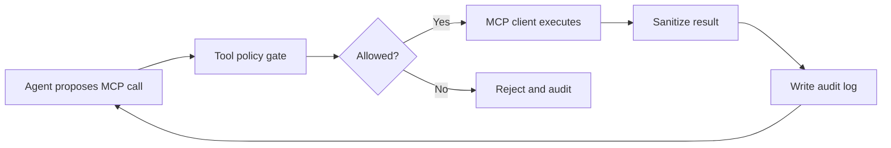
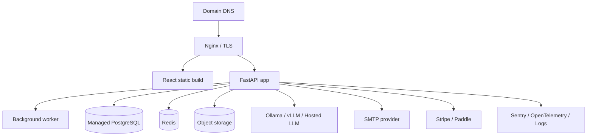
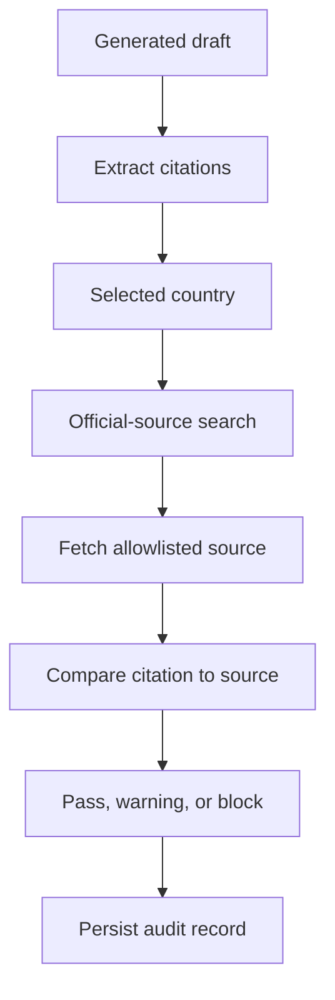

# Production Integration Guide

This guide explains what must be done to move the current local prototype toward
a real hosted product.

## 1. Real SMTP Credentials

Purpose:

- verify new user emails,
- send password reset links,
- notify users about support tickets, firm invitations, and review assignments.

Recommended providers:

- Amazon SES,
- Mailgun,
- SendGrid,
- Postmark,
- SMTP from a trusted business email provider.

What to configure:

```text
SMTP_HOST=smtp.provider.com
SMTP_PORT=587
SMTP_USERNAME=your_smtp_user
SMTP_PASSWORD=your_smtp_password
SMTP_FROM=noreply@yourdomain.com
SMTP_USE_TLS=true
APP_BASE_URL=https://yourdomain.com
```

Implementation steps:

1. Buy or configure the sending domain.
2. Add SPF, DKIM, and DMARC DNS records.
3. Create SMTP credentials in the provider dashboard.
4. Store credentials in production secrets, not in Git.
5. Set the environment variables on the server.
6. Test:

```bash
curl -X POST https://yourdomain.com/api/auth/request-email-verification \
  -H "Authorization: Bearer <token>"
```

7. Test password reset from the login page.
8. Log delivery failures without exposing tokens or passwords.

Production notes:

- Verification and reset tokens should be one-time use.
- Tokens should expire quickly, for example 15 to 60 minutes.
- Email logs should store metadata, not full secret links.

## 2. Stripe Or Paddle Live Checkout

Purpose:

- enforce free and paid usage plans,
- enable monthly and yearly subscriptions,
- unlock individual and firm tiers.

Recommended approach:

- Stripe if you want broad developer tooling and direct control.
- Paddle if you prefer merchant-of-record handling for tax/VAT complexity.

Environment variables:

```text
PAYMENT_PROVIDER=stripe
STRIPE_SECRET_KEY=sk_live_...
STRIPE_WEBHOOK_SECRET=whsec_...
STRIPE_PRICE_INDIVIDUAL_MONTHLY=price_...
STRIPE_PRICE_INDIVIDUAL_YEARLY=price_...
STRIPE_PRICE_FIRM_MONTHLY=price_...
```

Implementation steps:

1. Create products and prices in Stripe or Paddle.
2. Add checkout endpoint in backend:

```text
POST /api/billing/create-checkout-session
```

3. Redirect frontend users to checkout.
4. Add webhook endpoint:

```text
POST /api/billing/webhook
```

5. Verify webhook signature.
6. Update `subscriptions`, `billing_events`, and `usage_counters`.
7. Enforce usage before `/generate`.
8. Never trust plan state from the frontend.

Suggested limits:

| Plan | Drafts/month | Notes |
|---|---:|---|
| Free | 20 | Personal trial |
| Individual Pro | 50 | EUR 6.99 monthly or EUR 59.88 yearly |
| Firm Starter | 150 pooled | Senior/junior workflow |
| Firm Pro | Custom | Larger teams and higher storage |

## 3. Redis Service

Purpose:

- distributed rate limiting,
- draft generation job state,
- session revocation cache,
- background queue backend,
- temporary process status events.

Environment variables:

```text
REDIS_URL=redis://localhost:6379/0
RATE_LIMIT_DRAFTS_PER_MINUTE=5
```

Implementation steps:

1. Run Redis locally or use managed Redis.
2. Configure `REDIS_URL`.
3. Replace in-memory rate limits with Redis counters.
4. Add job queue support for long tasks:
   - RQ,
   - Celery,
   - Dramatiq,
   - Arq.
5. Store per-run progress events in Redis and persist final events to
   PostgreSQL.

Production command example:

```bash
docker run -p 6379:6379 redis:7
```

## 4. Real MCP Servers Connected And Audited

Purpose:

- let agents use controlled external tools,
- connect legal search, document storage, email, billing, DMS, CRM, or knowledge
  systems,
- keep all tool usage auditable.

Recommended MCP servers:

- official legal search MCP,
- document storage MCP,
- email/notification MCP,
- billing MCP,
- firm document-management MCP,
- internal knowledge base MCP.

Policy rule:

The LLM may propose a tool call, but the backend decides whether it is allowed.



What every MCP audit record should store:

- user ID,
- firm ID,
- matter ID,
- tool name,
- purpose,
- country/jurisdiction,
- input hash,
- output hash,
- source URL or object ID,
- allow/deny decision,
- timestamp.

## 5. Production Hosting

Recommended early production layout:



Minimum production requirements:

- HTTPS only,
- secure cookies or bearer token storage policy,
- PostgreSQL backups,
- object storage backups,
- rotating logs,
- health checks,
- deploy rollback plan,
- environment-specific secrets,
- error monitoring,
- background worker for long generation jobs.

Deployment steps:

1. Build frontend:

```bash
cd web/frontend
npm run build
```

2. Build backend Docker image:

```bash
docker build -f deploy/docker/backend.Dockerfile -t legal-ai-backend .
```

3. Run database migration:

```bash
python scripts/init_database.py
```

4. Start API, worker, Redis, PostgreSQL, and Nginx.
5. Configure TLS certificates using Let's Encrypt or cloud provider TLS.
6. Verify:

```text
GET /health
POST /api/auth/register
POST /api/auth/login
POST /generate
```

## 6. Pretrained Classifier Integration

Purpose:

- classify uploaded legal documents before routing,
- map unknown files to the closest supported document type,
- use your existing classifier project as the first workflow step.

Current hook:

```text
DOCUMENT_CLASSIFIER_COMMAND
```

Expected behavior:

- backend sends file path or text to your classifier command,
- classifier returns JSON,
- backend maps result to practice area and document type.

Suggested classifier output:

```json
{
  "practice_area": "Employment Law",
  "document_type": "Dismissal Protection Suit",
  "confidence": 0.94,
  "language": "de",
  "jurisdiction": "DE",
  "required_fields": ["court", "plaintiff_name", "defendant_company"],
  "warnings": []
}
```

Environment example:

```text
DOCUMENT_CLASSIFIER_COMMAND=python C:\path\to\classifier\classify.py --json
```

Implementation steps:

1. Ensure your classifier can run from the command line.
2. Ensure it prints JSON only.
3. Add timeout and error handling.
4. Map classifier labels to the app's sample library labels.
5. If confidence is low, route to "custom legal document" and ask for user
   confirmation.

## 7. Official-Law Retrieval And Citation Validation

Purpose:

- prevent country-law mixing,
- ensure draft citations are grounded in official sources,
- audit every accepted or rejected legal source.

User must provide:

- country,
- jurisdiction when needed,
- legal domain or practice area.

Backend must enforce:

- country-specific allowlist,
- no arbitrary web search sources,
- audit records for every fetch,
- no draft reliance on rejected sources.

Example allowlist policy:

```json
{
  "DE": ["gesetze-im-internet.de", "rechtsprechung-im-internet.de", "bundesarbeitsgericht.de"],
  "EU": ["eur-lex.europa.eu", "curia.europa.eu"]
}
```

Validation flow:



Production steps:

1. Build country allowlists with lawyer approval.
2. Use official APIs or official search MCP where possible.
3. Cache official source snapshots.
4. Match draft citations to retrieved source text.
5. Block or warn on unmatched citations.
6. Show source provenance to the reviewer.

## 8. Stable APP_ENCRYPTION_KEY

Purpose:

- encrypt provider API keys and sensitive provider configuration.

Generate a Fernet key:

```bash
python -c "from cryptography.fernet import Fernet; print(Fernet.generate_key().decode())"
```

Set it:

```text
APP_ENCRYPTION_KEY=<generated_fernet_key>
```

Production storage:

- AWS Secrets Manager,
- Azure Key Vault,
- GCP Secret Manager,
- Docker/Kubernetes secret,
- encrypted server environment store.

Important:

- Do not commit this key.
- Do not rotate it casually without a re-encryption plan.
- If the key is lost, encrypted provider API keys cannot be decrypted.
- Use separate keys for development, staging, and production.

## 9. What To Put In The Database

Keep structured and queryable data in PostgreSQL:

- users,
- firms,
- sessions,
- provider metadata,
- encrypted provider secrets,
- matters,
- document metadata,
- generated draft metadata,
- feedback,
- subscriptions,
- usage counters,
- support tickets,
- agent run summaries,
- audit logs.

Do not store large raw files directly in PostgreSQL. Store these in object
storage and keep only metadata and hashes in the database:

- uploaded PDFs/DOCX files,
- OCR outputs,
- generated DOCX/PDF exports,
- full trace bundles,
- long draft versions.

Use vector storage for:

- section chunks,
- embeddings,
- source metadata,
- tenant and matter filters.

## 10. Recommended Production Order

Do the integrations in this order:

1. Stable `APP_ENCRYPTION_KEY`.
2. PostgreSQL migration and backup.
3. SMTP email verification and password reset.
4. Redis for rate limits and job progress.
5. Stripe or Paddle test mode.
6. Background worker for generation jobs.
7. Object storage for uploads and exports.
8. Pretrained classifier command hook.
9. Official-law retrieval and citation validation.
10. Real MCP server integration with audit policy.
11. Production deployment with TLS, monitoring, and backups.
