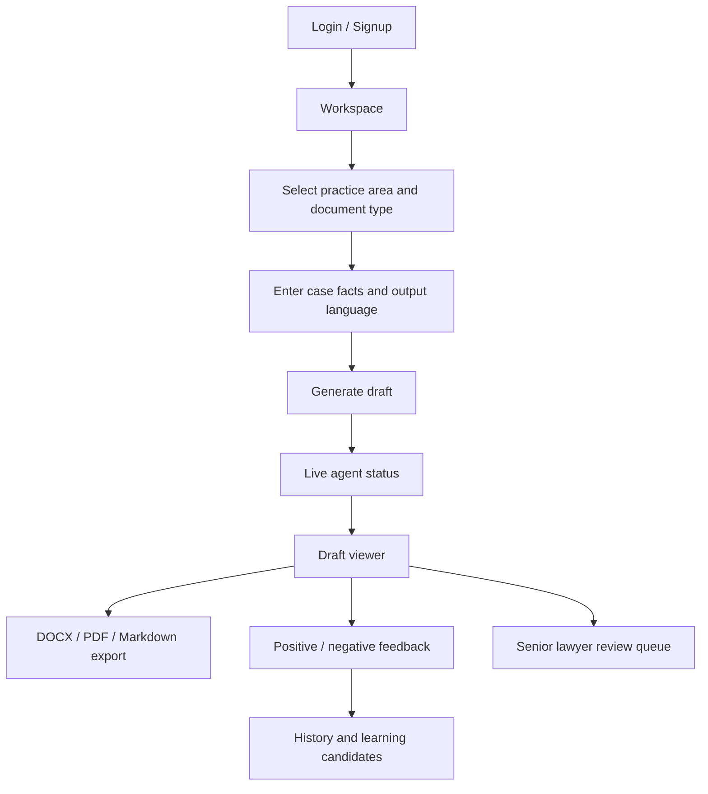
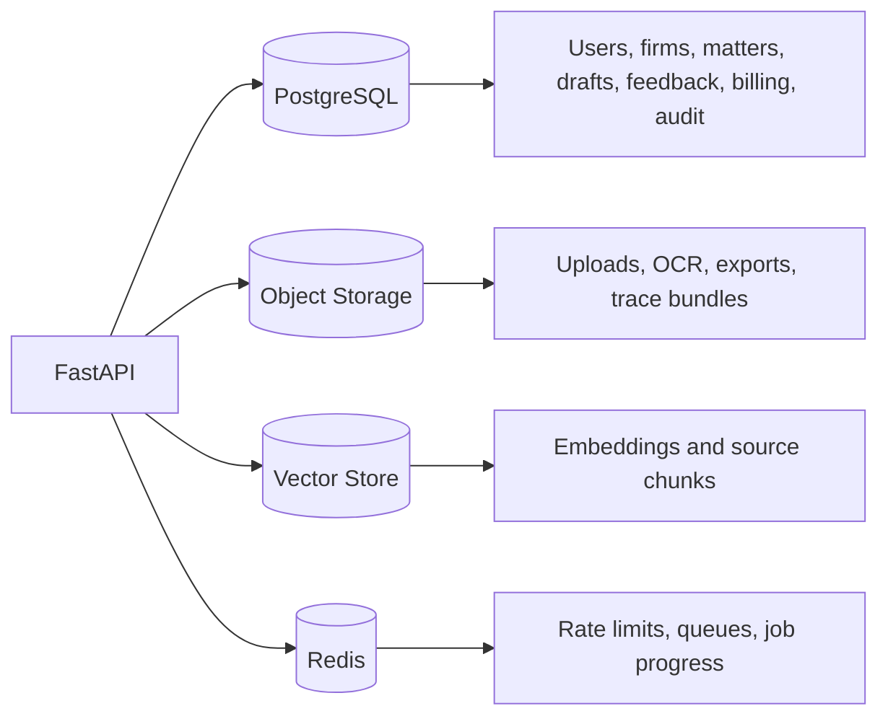

# Production Web Application Plan

This document describes the web application direction. The current app is still
a prototype, but it now represents the main production screens and backend
contracts.

## Recommended Stack

Backend: **FastAPI**

Why:

- Python-native and aligned with the existing pipeline.
- Good request validation and OpenAPI support.
- Works well for uploads, agent orchestration, background jobs, and provider
  routing.

Frontend: **React + TypeScript + Vite**

Why:

- Strong fit for document review, dashboards, forms, and dynamic agent status.
- TypeScript helps keep frontend and backend contracts explicit.
- Vite keeps local iteration fast.

Database: **PostgreSQL**

Why:

- Strong relational model for firms, users, matters, drafts, feedback, billing,
  and audit logs.
- Can later add `pgvector` for early vector retrieval.

## Current Screens

| Screen | Purpose |
|---|---|
| Workspace | Generate drafts from selected practice area, document type, facts, language, and provider |
| Sample Library | Browse many legal document categories and route one to workspace |
| History | View positive and negative feedback records |
| Profile | Manage name, designation, email verification, and password reset |
| Settings | Provider config, country policy, subscription-related settings |
| Firm Admin | Invite users, assign matters, senior review workflow |
| Contact | Contact form and AI chatbot support tickets |
| Auth | Login and signup |
| Legal Pages | Privacy, Terms, Impressum, GDPR |

## Production Workflow

## Production Backend Services

- authentication and sessions,
- firm RBAC and assignments,
- provider vault,
- subscription and usage limits,
- document ingestion,
- classifier routing,
- RAG indexing and retrieval,
- official-law validation,
- draft orchestration,
- export service,
- feedback and learning records,
- support ticket service,
- audit logging.

## Production Frontend Improvements

- Server-sent events or WebSockets for true streaming agent progress.
- Secure auth storage policy and refresh behavior.
- Redline comparison for lawyer review.
- Rich document preview for DOCX/PDF source files.
- Grounding panel showing which clauses and legal sources were used.
- Better admin dashboards for billing, usage, review queue, and audit logs.
- Accessibility and mobile layout pass.
- End-to-end tests for auth, generation, export, and feedback.

## Production Data Stores

## What Is Still External

The code has scaffolding for the production concerns, but these need real
external services before launch:

- SMTP provider,
- Stripe or Paddle live integration,
- Redis,
- object storage,
- MCP servers,
- official-law search connector,
- deployment infrastructure,
- monitoring and backups.

See `production_integration_guide.md` for the setup steps.
