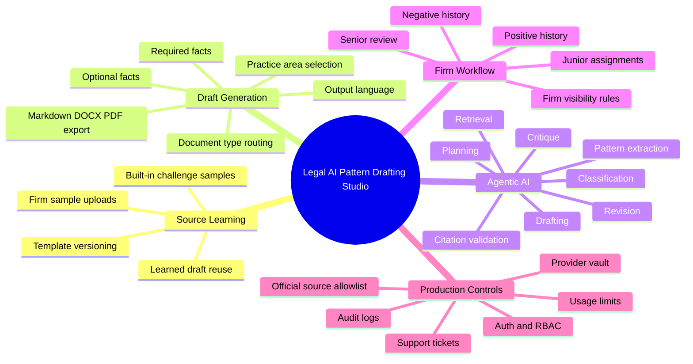
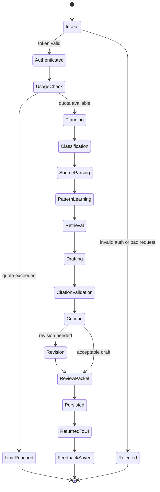
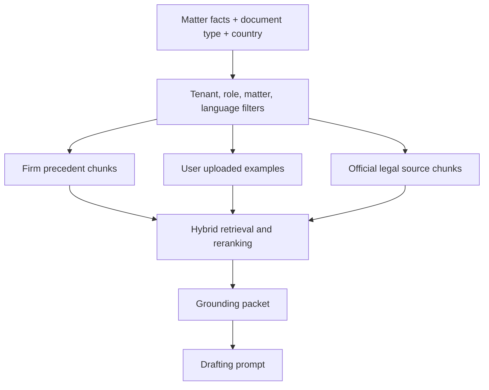
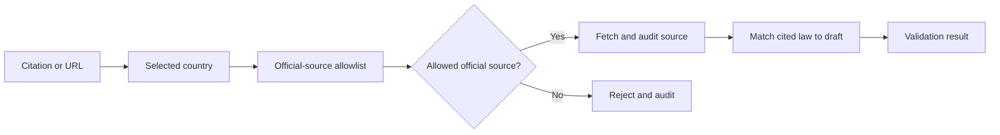
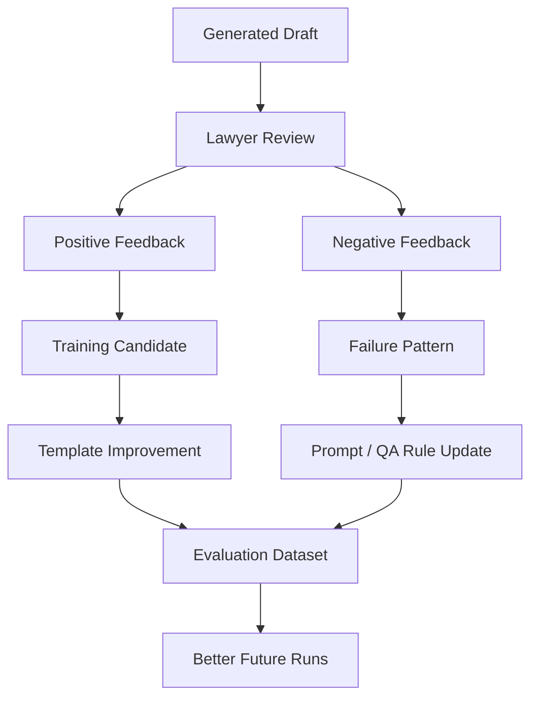

# System Design

This document presents the system as a product-ready design. It is useful for a
technical discussion, Loom walkthrough, architecture review, or future production
planning.

## Design Summary

Legal AI Pattern Drafting Studio is not one model per legal document type. It is
a reusable agentic workflow that can route many document categories through the
same core pipeline:

1. classify the document type,
2. learn patterns from approved samples,
3. retrieve relevant precedent and official law,
4. generate a grounded draft,
5. validate and revise,
6. route to lawyer review,
7. learn from feedback.

## Product Capabilities

## Core Components

```mermaid
flowchart TB
    subgraph Client["Client Application"]
        Workspace["Workspace"]
        Library["Sample Library"]
        History["History"]
        Admin["Firm Admin"]
        Profile["Profile and Settings"]
        Support["Contact and AI Support"]
    end

    subgraph Backend["FastAPI Backend"]
        Auth["Auth API"]
        ProfileAPI["Profile API"]
        GenerateAPI["Generate API"]
        LibraryAPI["Sample Library API"]
        AdminAPI["Firm Admin API"]
        ExportAPI["Export API"]
        SupportAPI["Support API"]
    end

    subgraph Workflow["Workflow Orchestration"]
        Gateway["RequestGateway"]
        Planner["PlanningAgent"]
        Parser["DocumentParserAgent"]
        Pattern["LLMPatternAgent"]
        Retriever["RetrievalAgent"]
        Generator["GroundedDraftingAgent"]
        Citation["CitationAgent"]
        Critic["CritiqueAgent"]
        Revision["RevisionAgent"]
        Review["HumanReviewAgent"]
    end

    subgraph Stores["Stores"]
        PG[("PostgreSQL")]
        Files[("Object Storage")]
        Vector[("Vector Store")]
        Logs[("Audit and Observability")]
    end

    Client --> Backend
    Backend --> Workflow
    Workflow --> Stores
```

## Request Lifecycle

## Agent Communication

Agents communicate through typed payloads and persisted run artifacts. They do
not share hidden mutable state.

```mermaid
flowchart LR
    Req["DraftRequest"] --> Plan["PlanArtifact"]
    Plan --> Parsed["ParsedDocuments"]
    Parsed --> Template["LearnedTemplate"]
    Template --> Chunks["RetrievedChunks"]
    Chunks --> Draft1["Draft v1"]
    Draft1 --> QA1["Critique and QA"]
    QA1 --> Draft2["Revised Draft"]
    Draft2 --> Review["Review Packet"]
    Review --> History["Feedback and History"]
```

Persisted artifacts should include:

- prompt version,
- model/provider,
- input summaries,
- selected sources,
- generated draft versions,
- QA findings,
- legal validation findings,
- final lawyer feedback.

## Retrieval Design

Prototype retrieval is lexical. Production retrieval should be hybrid:

- BM25 or lexical keyword match,
- embeddings/vector search,
- reranking,
- source allowlists,
- tenant/matter filtering,
- citation provenance tracking.

## Legal Source Validation

The production rule is strict: if the selected country is Germany, the legal
verification agent should not retrieve or rely on another country's law unless a
lawyer explicitly changes the jurisdiction.

## Feedback Learning Loop

Learning from user drafts should be controlled:

- ask permission before using drafts as learning examples,
- scope learning to the same user or firm tenant,
- mark examples as positive, negative, or pending review,
- avoid using rejected drafts as positive training material,
- store long-term training candidates separately from ordinary history.

## Production Non-Functional Requirements

| Area | Requirement |
|---|---|
| Security | Password hashing, bearer sessions, RBAC, encrypted provider keys |
| Privacy | PII handling, tenant isolation, retention policy, audit logs |
| Reliability | Background jobs, retries, graceful provider fallback |
| Observability | Structured logs, run timeline, metrics, error tracking |
| Compliance | Country-specific legal source policy and review workflow |
| Scale | PostgreSQL, Redis, object storage, vector DB, worker queue |
| Cost | Usage limits, provider routing, token/cost monitoring |
| Reviewability | Draft versions, redlines, QA reports, source provenance |

## Production Milestones

### Milestone 1: Local Product MVP

- FastAPI and React working locally.
- PostgreSQL schema initialized.
- Auth, draft generation, feedback history, and screenshots.
- Mock/Ollama/OpenAI-compatible provider support.

### Milestone 2: Private Beta

- SMTP provider.
- Stripe or Paddle test mode.
- Redis-backed rate limits.
- Object storage.
- Background worker.
- Pretrained classifier command hook connected.
- Official legal search allowlist tested.

### Milestone 3: Production SaaS

- Nginx/TLS and deployment automation.
- Managed PostgreSQL with backups.
- Real payment webhooks.
- Real MCP servers behind policy gate.
- Monitoring, alerts, and audit dashboards.
- Firm admin workflows and senior review queue.

### Milestone 4: Learning Platform

- Lawyer-approved feedback dataset.
- Template version approval.
- RAG evaluation set.
- Citation accuracy metrics.
- Optional LoRA fine-tuning after enough reviewed data.
- Optional LangGraph graph execution for resumable agent runs, conditional
  retries, and human-review interrupts.
