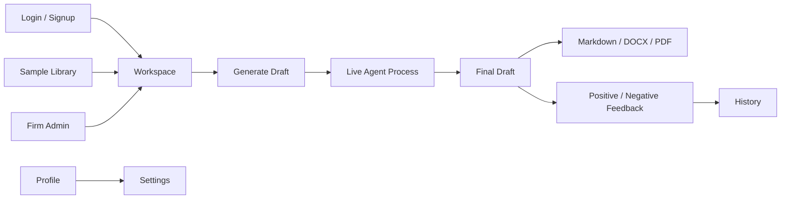

# Frontend

The frontend is a React + TypeScript + Vite application for Legal AI Pattern
Drafting Studio.

## Run Locally

```bash
cd C:\Users\DELL\Documents\Tasks\JUPUS\ai-challenge\legal_pattern_system\web\frontend
npm install
npm run dev
```

Open:

```text
http://127.0.0.1:5173
```

The Vite dev server proxies API calls to:

```text
http://127.0.0.1:8001
```

## Pages

| Page | Path | Purpose |
|---|---|---|
| Workspace | `/` | Select practice area, document type, facts, provider, language, and generate drafts |
| Sample Library | `/library` | Browse scalable legal document taxonomy and route selected type to workspace |
| Document Classifier | `/classifier` | Classify uploaded/pasted documents, route results to workspace, or add them as source examples |
| History | `/history` | Positive and negative feedback history |
| Profile | `/profile` | User profile, designation, verification, password reset |
| Settings | `/settings` | Provider configuration, country policy, subscription-related settings |
| Firm Admin | `/admin` | Invite users, assign matters, review junior workflow |
| Contact | `/contact` | Contact form and AI support ticket assistant |
| Login | `/login` | User login |
| Signup | `/signup` | Individual or firm registration |
| About | `/about` | Product overview |
| Careers | `/careers` | Careers page |
| Privacy | `/privacy` | Privacy policy |
| Terms | `/terms` | Terms |
| Impressum | `/impressum` | German legal notice page |
| GDPR | `/gdpr` | GDPR information |

## Frontend Flow



## Important UI Behaviors

- The process panel shows one active agent step at a time, then fades out and
  shows the final output.
- The full run trace remains available for debugging and reviewer visibility.
- The language selector changes the output language request sent to the backend.
- The sample library routes selected document types back to the workspace.
- Feedback is saved as positive or negative history for later review and
  learning.
- Provider API keys should never be displayed after being saved.

## Production UI Improvements

- Replace mock-friendly auth storage with secure cookie or hardened token policy.
- Add server-sent events or WebSockets for long-running agent jobs.
- Add redline review.
- Add document preview with source grounding panel.
- Add admin dashboards for usage, billing, review queues, and audit logs.
- Add accessibility pass and cross-browser testing before public launch.
